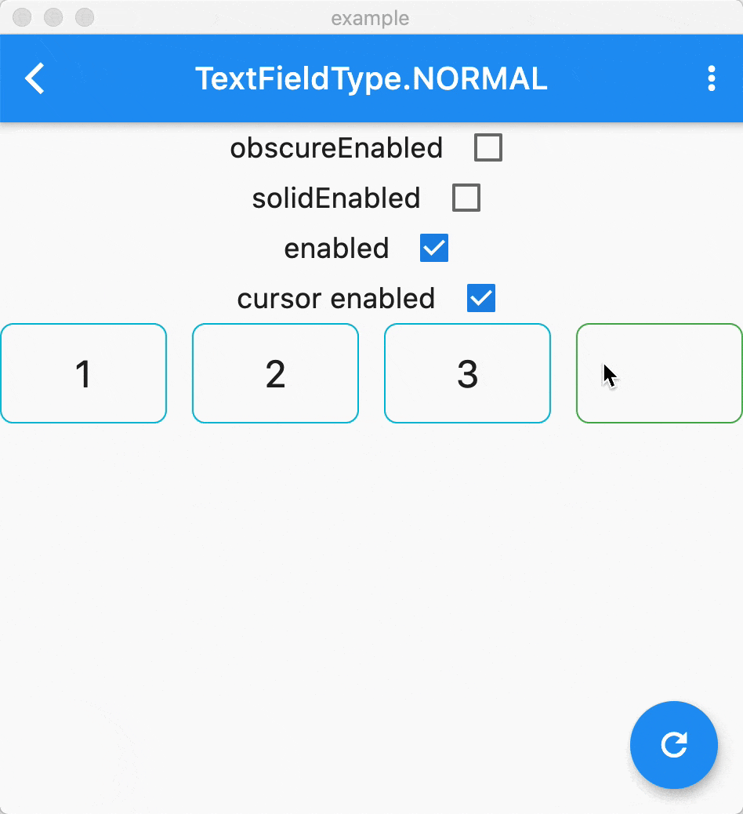

[](https://pub.dartlang.org/packages/pin_input_text_field)


# pin_input_text_field

[中文](./README_CN.md)
PinInputTextField is a TextField widget to help display different style pin. It supports all the platforms [flutter](https://github.com/flutter/flutter) supports.

## Notes 🚨
**please use 4.4.1 for flutter version is below 3.7.0**

## Feature 🌟
* allow you customized the shape, any!
* built-in 4 commonly used pin styles of shape
* obscure support
* solid support
* enterColor support
* cursor support
* support all the textField properties theoretically
* Flutter all platform support

## Example 🦀

Thanks to the [Flutter Web](https://flutter.dev/web), you can enjoy the preview by [website](https://tinoguo.github.io/pin_input_text_field/) without any installation. 

### Decoration 

**UnderlineDecoration**


**BoxLooseDecoration**



**BoxTightDecoration**


**CircleDecoration**


## Installing 🔧
Install the latest version from [pub](https://pub.dartlang.org/packages/pin_input_text_field).

## Usage ✍️

### Attributes
Customizable attributes for PinInputTextField
<table>
    <th>Attribute Name</th>
    <th>Example Value</th>
    <th>Description</th>
    <tr>
        <td>pinLength</td>
        <td>6</td>
        <td>The max length of pin, the default is 6</td>
    </tr>
    <tr>
        <td>onSubmit</td>
        <td>(String pin){}</td>
        <td>The callback will execute when user click done, sometimes is not working in Android.</td>
    </tr>
    <tr>
        <td>decoration</td>
        <td>BoxLooseDecoration</td>
        <td>Decorate the pin, there are 3 inside styles, the default is BoxLooseDecoration</td>
    </tr>
    <tr>
        <td>inputFormatters</td>
        <td>WhitelistingTextInputFormatter.digitsOnly</td>
        <td>Just like TextField's inputFormatter, the default is WhitelistingTextInputFormatter.digitsOnly</td>
    </tr>
    <tr>
        <td>keyboardType</td>
        <td>TextInputType.phone</td>
        <td>Just like TextField's keyboardType, the default is TextInputType.phone</td>
    </tr>
    <tr>
        <td>pinEditingController</td>
        <td>PinEditingController</td>
        <td>Controls the pin being edited. If null, this widget will create its own PinEditingController</td>
    </tr>
    <tr>
        <td>autoFocus</td>
        <td>false</td>
        <td>Same as TextField's autoFocus, the default is false</td>
    </tr>
    <tr>
        <td>focusNode</td>
        <td>FocusNode</td>
        <td>Same as TextField's focusNode</td>
    </tr>
    <tr>
        <td>textInputAction</td>
        <td>TextInputAction.done</td>
        <td>Same as TextField's textInputAction, not working in digit mode</td>
    </tr>
    <tr>
        <td>enabled</td>
        <td>true</td>
        <td>Same as TextField's enabled, the default is true</td>
    </tr>
    <tr>
        <td>onChanged</td>
        <td>(String pin){}</td>
        <td>Same as TextField's onChanged</td>
    </tr>
    <tr>
        <td>textCapitalization</td>
        <td>TextCapitalization.words</td>
        <td>Same as TextField's textCapitalization</td>
    </tr>
    <tr>
        <td>cursor</td>
        <td>Cursor.disabled()</td>
        <td>The cursor of the pin, default is not enabled</td>
    </tr>
</table>

### FormField
Instead of using PinInputTextField, using PinInputTextFormField to control validate.

### ObscureStyle 

```
/// Determine whether replace [obscureText] with number.
final bool isTextObscure;
/// The display text when [isTextObscure] is true, emoji supported
final String obscureText;
```

## Known Issue 🥶

The `PinEditingController` listener will execute more than once when programmatically set text, you can filter some duplicate values in your code.

## License

```text
Copyright 2019 Tino Guo.

Licensed under the Apache License, Version 2.0 (the "License");
you may not use this file except in compliance with the License.
You may obtain a copy of the License at

   http://www.apache.org/licenses/LICENSE-2.0

Unless required by applicable law or agreed to in writing, software
distributed under the License is distributed on an "AS IS" BASIS,
WITHOUT WARRANTIES OR CONDITIONS OF ANY KIND, either express or implied.
See the License for the specific language governing permissions and
limitations under the License.
```