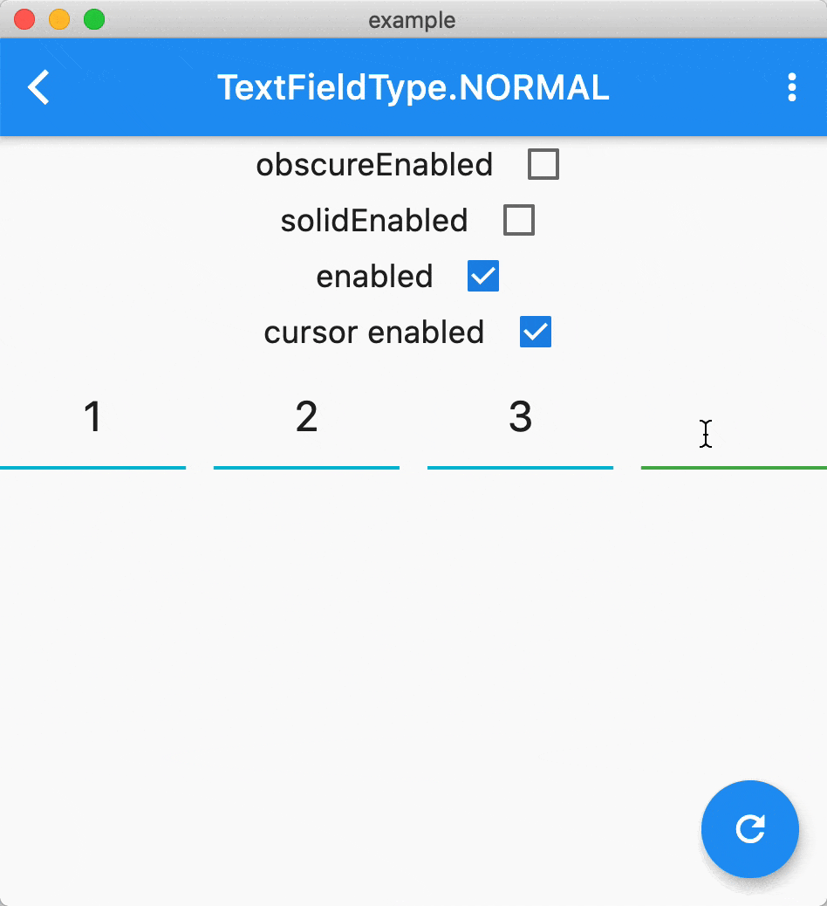
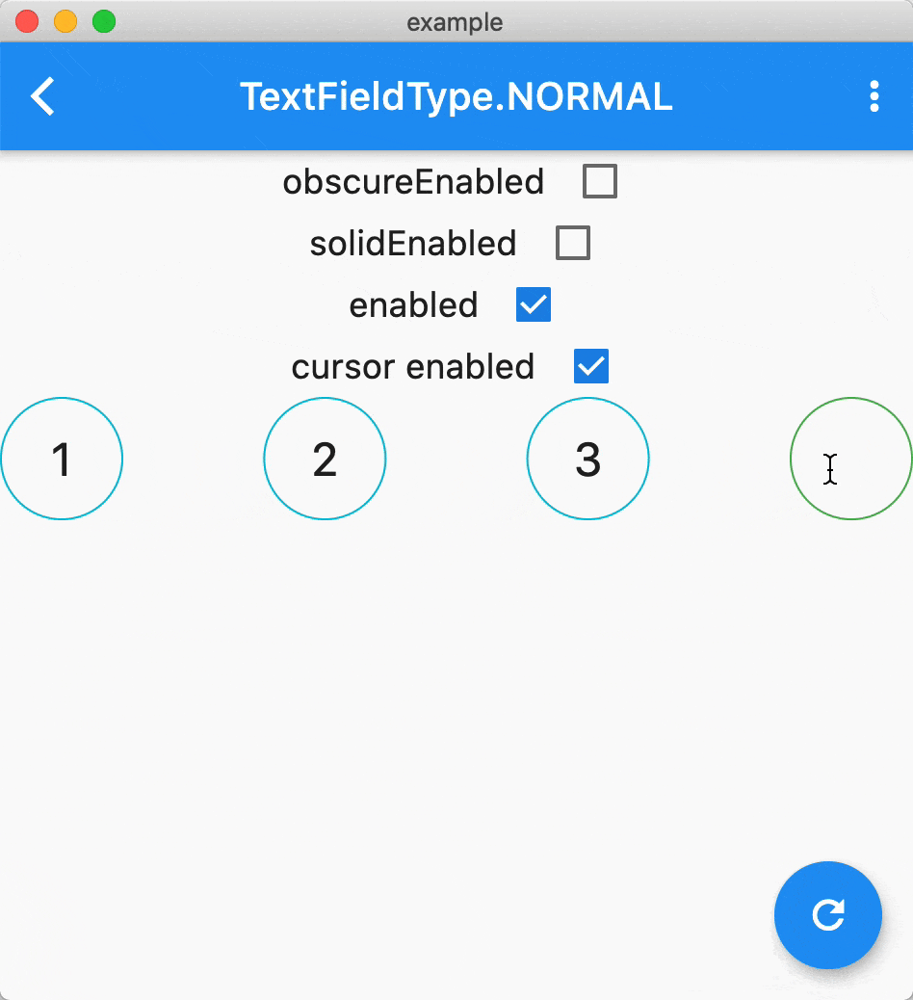

[](https://pub.dartlang.org/packages/pin_input_text_field)


# pin_input_text_field

[中文版点我](./README_CN.md)   
PinInputTextField is a TextField widget to help display different style pin. It supports all the platforms [flutter](https://github.com/flutter/flutter) supports.

## Feature 👇👇
* allow you customized the shape, any!
* built-in 4 commonly used pin styles of shape
* obscure support
* solid support
* enterColor support
* support all the textField properties support
* Flutter web support

## Example 💎

Thanks to the [Flutter Web](https://flutter.dev/web), you can enjoy the preview by [website](https://tinoguo.github.io/pin_input_text_field/) without any installation. 

### Decoration 

**UnderlineDecoration**



**BoxLooseDecoration**


**BoxTightDecoration**


**CircleDecoration**



## Installing 🔧
Install the latest version from [pub](https://pub.dartlang.org/packages/pin_input_text_field).

## Usage 🚅

### Attributes
Customizable attributes for PinInputTextField
<table>
    <th>Attribute Name</th>
    <th>Example Value</th>
    <th>Description</th>
    <tr>
        <td>pinLength</td>
        <td>6</td>
        <td>The max length of pin, the default is 6</td>
    </tr>
    <tr>
        <td>onSubmit</td>
        <td>(String pin){}</td>
        <td>The callback will execute when user click done, sometimes is not working in Android.</td>
    </tr>
    <tr>
        <td>decoration</td>
        <td>BoxLooseDecoration</td>
        <td>Decorate the pin, there are 3 inside styles, the default is BoxLooseDecoration</td>
    </tr>
    <tr>
        <td>inputFormatters</td>
        <td>WhitelistingTextInputFormatter.digitsOnly</td>
        <td>Just like TextField's inputFormatter, the default is WhitelistingTextInputFormatter.digitsOnly</td>
    </tr>
    <tr>
        <td>keyboardType</td>
        <td>TextInputType.phone</td>
        <td>Just like TextField's keyboardType, the default is TextInputType.phone</td>
    </tr>
    <tr>
        <td>pinEditingController</td>
        <td>PinEditingController</td>
        <td>Controls the pin being edited. If null, this widget will create its own PinEditingController</td>
    </tr>
    <tr>
        <td>autoFocus</td>
        <td>false</td>
        <td>Same as TextField's autoFocus, the default is false</td>
    </tr>
    <tr>
        <td>focusNode</td>
        <td>FocusNode</td>
        <td>Same as TextField's focusNode</td>
    </tr>
    <tr>
        <td>textInputAction</td>
        <td>TextInputAction.done</td>
        <td>Same as TextField's textInputAction, not working in digit mode</td>
    </tr>
    <tr>
        <td>enabled</td>
        <td>true</td>
        <td>Same as TextField's enabled, the default is true</td>
    </tr>
    <tr>
        <td>onChanged</td>
        <td>(String pin){}</td>
        <td>Same as TextField's onChanged</td>
    </tr>
</table>

### FormField
Instead of using PinInputTextField, using PinInputTextFormField to control validate.

### ObscureStyle 

```
/// Determine whether replace [obscureText] with number.
final bool isTextObscure;
/// The display text when [isTextObscure] is true, emoji supported
final String obscureText;
```

## Contributors 🙏

This project exists thanks to all the people who contribute.

[rajajain08](https://github.com/rajajain08)

[alyyasser](https://github.com/alyyasser)

[daniel-v](https://github.com/daniel-v)

## Notice after Version 2.0.0 ⚠️
Please set the selection when you set the text programmatically, just like [this](https://github.com/TinoGuo/pin_input_text_field/blob/77dee70a8da25b11eae96f5a03842e5a67174a80/example/lib/main.dart#L81).

Don't set the selection in lib code since if it will cause dead loop in iOS. 🤔

**If you have any idea, please make a [Pull Request](https://github.com/TinoGuo/pin_input_text_field/pulls).**

## Known Issue 🥶

The `PinEditingController` listener will execute more than once when programmatically set text, you can filter some duplicate values in your code. 