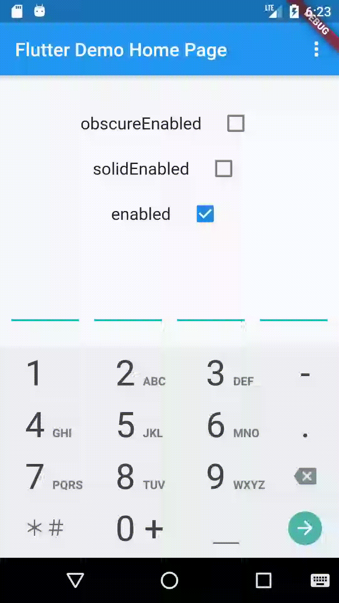
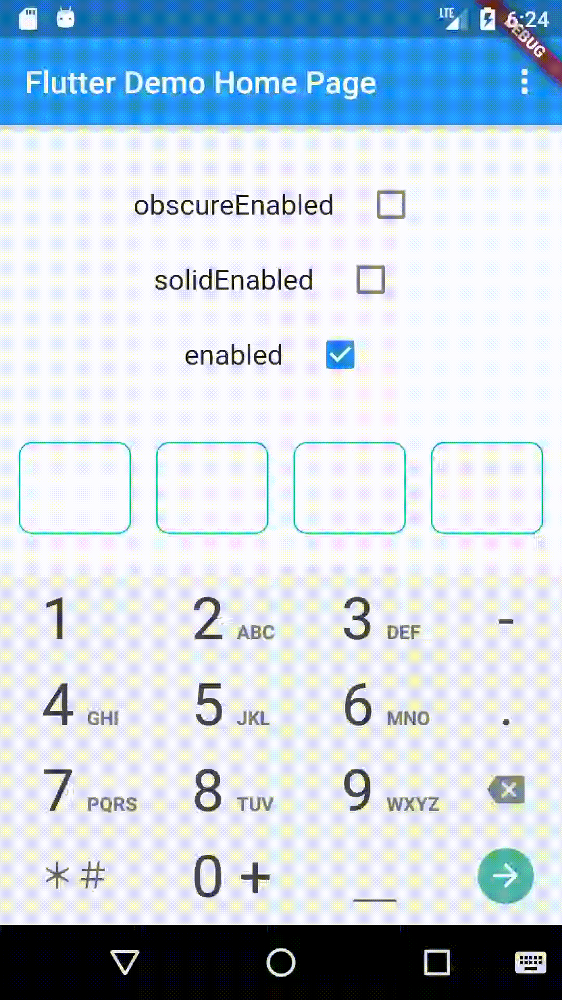
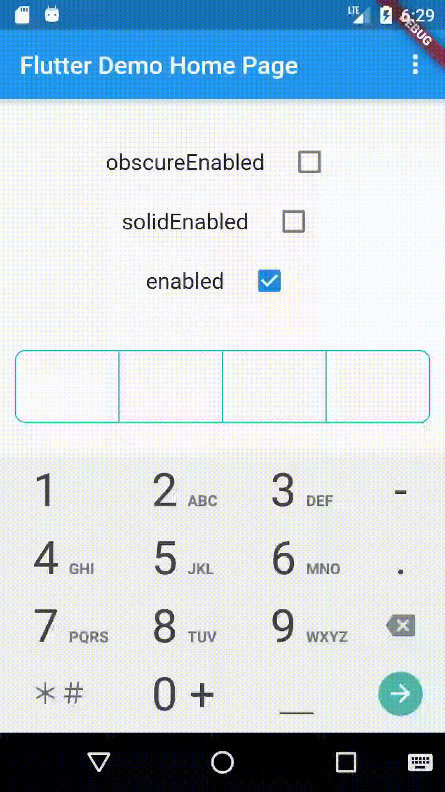
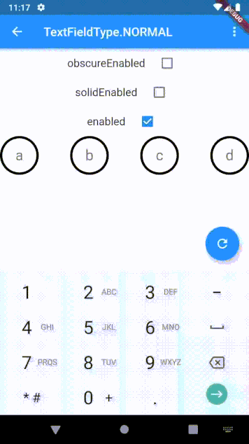

[](https://pub.dartlang.org/packages/pin_input_text_field?branch=master)


# pin_input_text_field

[English](./README.md)
PinInputTextField是一个Flutter平台上用来展示不同样式的验证码，简单好用！支持所有[flutter](https://github.com/flutter/flutter)支持的平台

## 注意 🚨
**对于flutter版本在3.7.0以下的请使用4.4.1**

## 特点 🌟
* 允许你最大化自由的定制任意Shape!
* 内置4种常用验证码风格
* 支持隐藏明文
* 支持填充色
* 支持输入色
* 支持光标
* 理论上支持所有TextField的属性
* 支持Flutter所有平台

## 例子 🌰

现在你可以通过浏览器直接访问这个[网址](https://tinoguo.github.io/pin_input_text_field/)来预览效果，而不需要任何安装。

### 装饰器

**UnderlineDecoration**




**BoxLooseDecoration**




**BoxTightDecoration**



**CircleDecoration**



## 安装 ✍️
从[pub](https://pub.dartlang.org/packages/pin_input_text_field)安装最新版.

## 使用

### 属性
PinInputTextField的自定义属性
<table>
    <th>属性名</th>
    <th>参考值</th>
    <th>描述</th>
    <tr>
        <td>pinLength</td>
        <td>6</td>
        <td>验证码的长度, 默认是6</td>
    </tr>
    <tr>
        <td>onSubmit</td>
        <td>(String pin){}</td>
        <td>用户点击键盘右下角时触发，Android平台有时不一定生效</td>
    </tr>
    <tr>
        <td>decoration</td>
        <td>BoxLooseDecoration</td>
        <td>内置三种验证码样式，默认是BoxLooseDecoration</td>
    </tr>
    <tr>
        <td>inputFormatters</td>
        <td>WhitelistingTextInputFormatter.digitsOnly</td>
        <td>跟TextField的inputFormatters一样, 默认是WhitelistingTextInputFormatter.digitsOnly</td>
    </tr>
    <tr>
        <td>keyboardType</td>
        <td>TextInputType.phone</td>
        <td>跟TextField的keyboardType一样, 默认是TextInputType.phone</td>
    </tr>
    <tr>
        <td>pinEditingController</td>
        <td>PinEditingController</td>
        <td>控制和监听用户输入。如果为空，内部会创建一个默认的控制器</td>
    </tr>
    <tr>
        <td>autoFocus</td>
        <td>false</td>
        <td>跟TextField的autoFocus一样, 默认是false</td>
    </tr>
    <tr>
        <td>focusNode</td>
        <td>FocusNode</td>
        <td>跟TextField的focusNode一样.</td>
    </tr>
    <tr>
        <td>textInputAction</td>
        <td>TextInputAction.done</td>
        <td>跟TextField的textInputAction一样, 数字模式下无效</td>
    </tr>
    <tr>
        <td>enabled</td>
        <td>true</td>
        <td>跟TextField的enabled一样, 默认是true</td>
    </tr>
    <tr>
        <td>onChanged</td>
        <td>(String pin){}</td>
        <td>跟TextField的onChanged一样</td>
     </tr>
    <tr>
        <td>textCapitalization</td>
        <td>TextCapitalization.words</td>
        <td>跟TextField的textCapitalization一样</td>
    </tr>
    <tr>
        <td>cursor</td>
        <td>Cursor.disabled()</td>
        <td>验证码的游标，默认不开启</td>
     </tr>
</table>

### 表单验证

请使用PinInputTextFormField来做表单验证.

### 密码模式

```
/// 是否需要替换[obscureText]开启密码模式.
final bool isTextObscure;
/// 当[isTextObscure]开启时，替换验证码的字符串，支持emoji
final String obscureText;
```

## 已知问题 🥶

目前`PinEditingController`的Listener会在手动设置text值时执行多次，可以在应用层的代码上过滤下

## License

```text
Copyright 2019 Tino Guo.

Licensed under the Apache License, Version 2.0 (the "License");
you may not use this file except in compliance with the License.
You may obtain a copy of the License at

   http://www.apache.org/licenses/LICENSE-2.0

Unless required by applicable law or agreed to in writing, software
distributed under the License is distributed on an "AS IS" BASIS,
WITHOUT WARRANTIES OR CONDITIONS OF ANY KIND, either express or implied.
See the License for the specific language governing permissions and
limitations under the License.
```