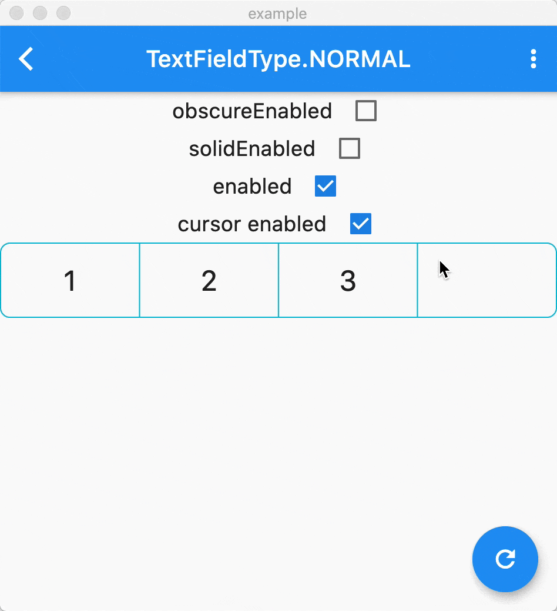

[](https://pub.dartlang.org/packages/pin_input_text_field) 

# pin_input_text_field

PinInputTextField是一个Flutter平台上用来展示不同样式的验证码，简单好用！

## 例子🌰

### 装饰器

UnderlineDecoration


BoxLooseDecoration


BoxTightDecoration



## 安装
从[pub](https://pub.dartlang.org/packages/pin_input_text_field)安装最新版.

## 使用

### 属性
PinInputTextField的自定义属性
<table>
    <th>属性名</th>
    <th>参考值</th>
    <th>描述</th>
    <tr>
        <td>pinLength</td>
        <td>6</td>
        <td>验证码的长度, 默认是6</td>
    </tr>
    <tr>
        <td>onSubmit</td>
        <td>(String pin){}</td>
        <td>用户点击键盘右下角时触发，Android平台有时不一定生效</td>
    </tr>
    <tr>
        <td>decoration</td>
        <td>BoxLooseDecoration</td>
        <td>内置三种验证码样式，默认是BoxLooseDecoration</td>
    </tr>
    <tr>
        <td>inputFormatters</td>
        <td>WhitelistingTextInputFormatter.digitsOnly</td>
        <td>跟TextField的inputFormatters一样, 默认是WhitelistingTextInputFormatter.digitsOnly</td>
    </tr>
    <tr>
        <td>keyboardType</td>
        <td>TextInputType.phone</td>
        <td>跟TextField的keyboardType一样, 默认是TextInputType.phone</td>
    </tr>
    <tr>
        <td>pinEditingController</td>
        <td>PinEditingController</td>
        <td>控制和监听用户输入。如果为空，内部会创建一个默认的控制器</td>
    </tr>
    <tr>
        <td>autoFocus</td>
        <td>false</td>
        <td>跟TextField的autoFocus一样, 默认是false</td>
    </tr>
    <tr>
        <td>focusNode</td>
        <td>FocusNode</td>
        <td>跟TextField的focusNode一样.</td>
    </tr>
    <tr>
        <td>textInputAction</td>
        <td>TextInputAction.done</td>
        <td>跟TextField的textInputAction一样, 数字模式下无效</td>
    </tr>
    <tr>
        <td>enabled</td>
        <td>true</td>
        <td>跟TextField的enabled, 默认是true</td>
    </tr>
</table>

### 密码模式

```
/// 是否需要替换[obscureText]开启密码模式.
final bool isTextObscure;
/// 当[isTextObscure]开启时，替换验证码的字符串，支持emoji
final String obscureText;
```

## 已知问题

目前`PinEditingController`的Listener会执行多次，可以在应用层的代码上过滤下